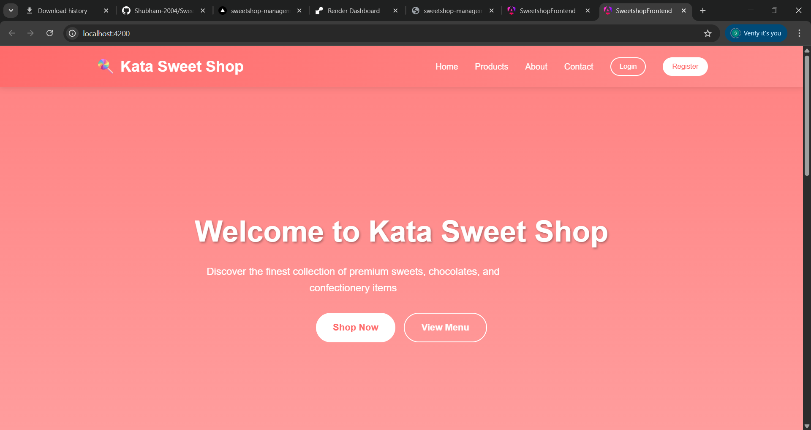
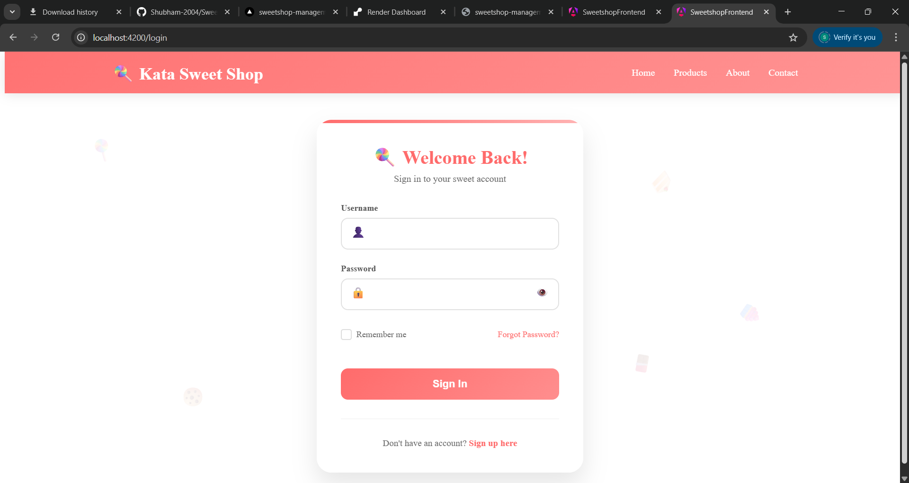
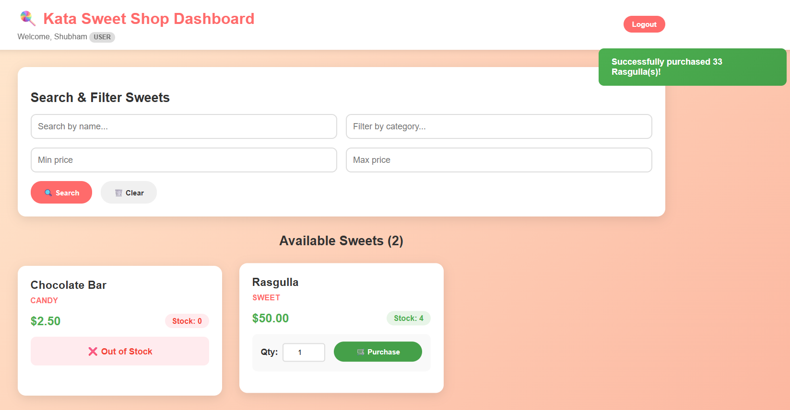
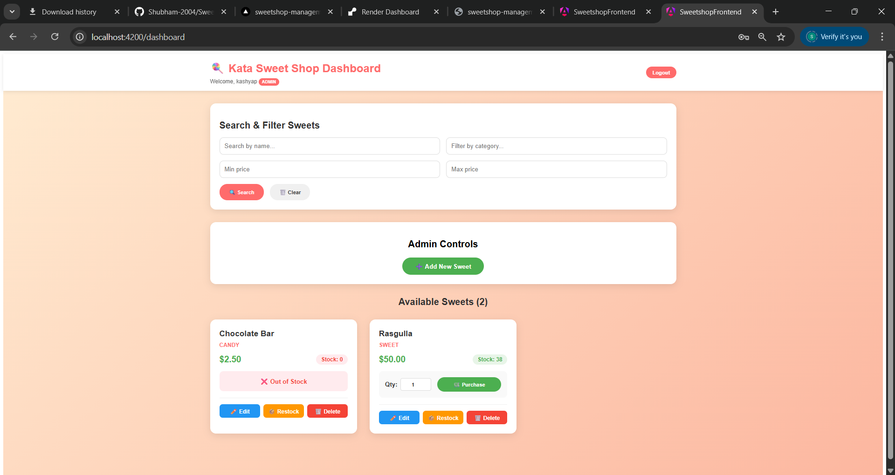
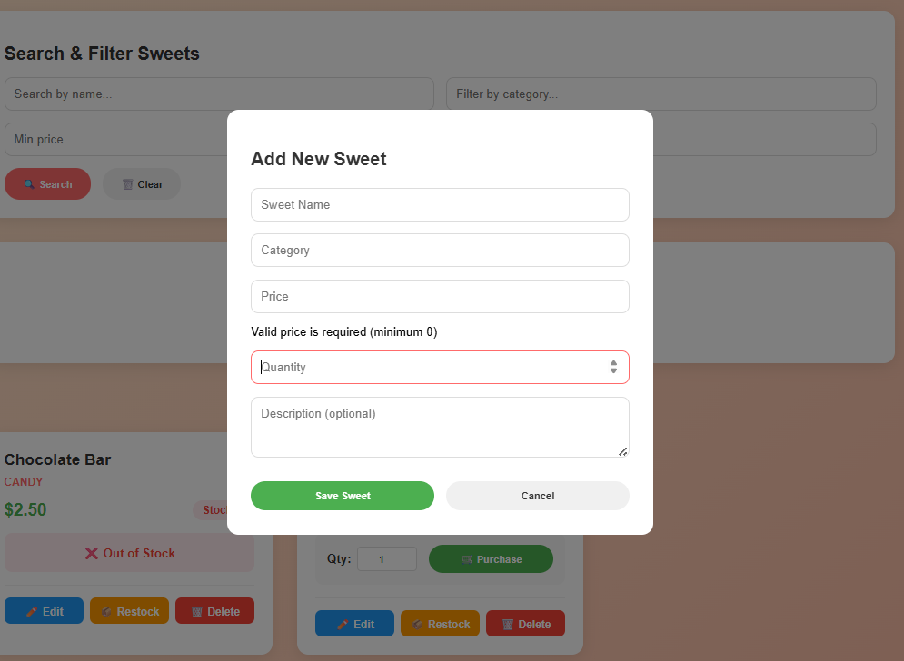
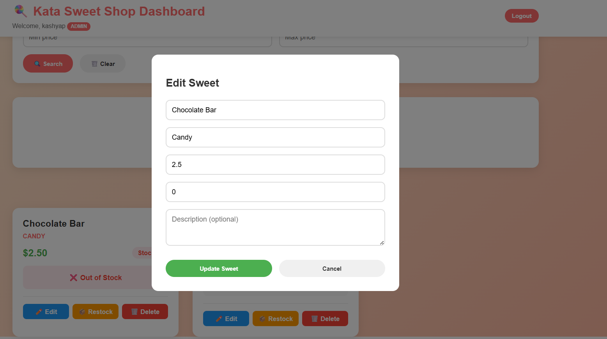
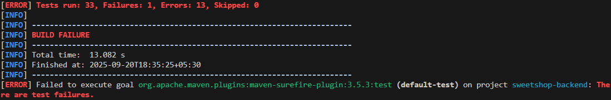

# 🍭 Sweet Shop Management System

A comprehensive full-stack web application for managing a sweet shop's inventory, sales, and user interactions. Built with Spring Boot backend and Angular frontend.

## 🎯 Project Overview

The Sweet Shop Management System is a modern web application designed to streamline the operations of a confectionery business. It provides a user-friendly interface for customers to browse and purchase sweets, while offering comprehensive administrative tools for inventory management.

### Key Objectives:
- **Customer Experience**: Intuitive browsing and purchasing interface
- **Inventory Management**: Real-time stock tracking and management
- **User Management**: Role-based access control (Admin/User)
- **Sales Processing**: Secure transaction handling
- **Responsive Design**: Optimized for desktop and mobile devices

## ✨ Features

### 🛍️ Customer Features
- **Product Browsing**: View all available sweets with details
- **Search & Filter**: Find products by name, category, and price range
- **Purchase System**: Add items to cart and complete purchases
- **Stock Visibility**: Real-time stock level information
- **Responsive Design**: Mobile-friendly interface

### 👨‍💼 Admin Features
- **Inventory Management**: Add, edit, delete sweet products
- **Stock Management**: Restock items and track quantities
- **User Management**: Role-based access control
- **Sales Monitoring**: Track purchases and inventory changes
- **Admin Dashboard**: Comprehensive control panel

### 🔐 Authentication & Security
- **JWT Authentication**: Secure token-based authentication
- **Role-based Access**: Different permissions for admin and regular users
- **Session Management**: Persistent login with remember me option
- **CORS Configuration**: Secure cross-origin resource sharing

## 🛠️ Technology Stack

### Backend
- **Java 17+**: Core programming language
- **Spring Boot 3.x**: Application framework
- **Spring Security**: Authentication and authorization
- **Spring Data JPA**: Data persistence layer
- **MongoDB Database**: In-memory database for development
- **Maven**: Dependency management
- **JWT**: JSON Web Tokens for authentication

### Frontend
- **Angular 18+**: Frontend framework
- **TypeScript**: Programming language
- **Angular CLI**: Development tools
- **RxJS**: Reactive programming
- **Angular Forms**: Form handling
- **CSS3**: Styling and animations
- **Responsive Design**: Mobile-first approach

## 📋 Prerequisites

Before running this application, ensure you have the following installed:

- **Java Development Kit (JDK) 17 or higher**
- **Node.js 18+ and npm**
- **Angular CLI**: `npm install -g @angular/cli`
- **Maven 3.6+** (or use included Maven wrapper)
- **Git** for version control

## 🚀 Installation & Setup

### 1. Clone the Repository
```bash
git clone https://github.com/Shubham-2004/Sweetshop-Management-System.git
cd Sweetshop-Management-System
```

### 2. Backend Setup (Spring Boot)

#### Navigate to backend directory:
```bash
cd sweetshop-backend
```

#### Install dependencies and build:
```bash

./mvnw clean install

mvn clean install
```

#### Configure Database (Optional):
The application uses H2 in-memory database by default. To use a different database, update `src/main/resources/application.properties`:

```properties
# MongoDB Database (Default - no changes needed)
spring.application.name=sweetshop-backend
spring.data.mongodb.uri=mongodb://localhost:27017/sweetShopDB

# JWT Configuration
jwt.secret=mySecretKey
jwt.expiration=86400000
```

### 3. Frontend Setup (Angular)

#### Navigate to frontend directory:
```bash
cd ../sweetshop-frontend
```

#### Install dependencies:
```bash
npm install
```

#### Install Angular CLI globally (if not already installed):
```bash
npm install -g @angular/cli
```

## 🔄 Running the Application

### 1. Start the Backend Server

```bash
cd sweetshop-backend

# Using Maven wrapper
./mvnw spring-boot:run

# Or using system Maven
mvn spring-boot:run

# Alternative: Run the JAR file
java -jar target/sweetshop-backend-0.0.1-SNAPSHOT.jar
```

The backend server will start on: **http://localhost:8080**

### 2. Start the Frontend Development Server

```bash
cd sweetshop-frontend

# Start Angular development server
ng serve

# Or specify port
ng serve --port 4200
```

The frontend application will start on: **http://localhost:4200**

### 3. Access the Application

- **Frontend**: http://localhost:4200
- **Backend API**: http://localhost:8080
- **H2 Database Console**: http://localhost:8080/h2-console

#### Regular User:
Create a new account through the registration form or use the signup functionality.

## 📚 API Documentation

### Authentication Endpoints
```
POST /api/auth/login     - User login
POST /api/auth/signup    - User registration
```

### Sweet Management Endpoints
```
GET    /api/sweets              - Get all sweets
GET    /api/sweets/search       - Search sweets with filters
POST   /api/sweets              - Add new sweet (Admin only)
PUT    /api/sweets/{id}         - Update sweet (Admin only)
DELETE /api/sweets/{id}         - Delete sweet (Admin only)
POST   /api/sweets/{id}/purchase - Purchase sweet
POST   /api/sweets/{id}/restock  - Restock sweet (Admin only)
```

### Admin Endpoints
```
GET /api/admin/check - Check admin status
```

### Request/Response Examples

#### Login Request:
```json
POST /api/auth/login
{
    "username": "kashyap",
    "password": "patel123"
}
```

#### Add Sweet Request:
```json
POST /api/sweets
Authorization: Bearer <jwt-token>
{
    "name": "Chocolate Cake",
    "category": "Cakes",
    "price": 15.99,
    "quantity": 50,
    "description": "Delicious chocolate cake"
}
```

## 📸 Screenshots

### 🏠 Landing Page

*Modern landing page with sweet shop branding and navigation*

### 🔐 Login/Signup Page

*Responsive authentication form with toggle between login and signup*

### 📊 User Dashboard

*Clean dashboard showing available sweets with search and purchase functionality*

### 👨‍💼 Admin Dashboard

*Comprehensive admin panel with inventory management tools*

### ➕ Admin - Add Sweet

*Modal form for adding new sweet products (Admin only)*

### ✏️ Admin - Edit Sweet

*Comprehensive edit form for updating sweet information*

### 🧪 Testing Cases

*Comprehensive edit form for updating sweet information*

## 🧪 Testing

### Backend Tests
Run the Spring Boot test suite:

```bash
cd sweetshop-backend

# Run all tests
./mvnw test

# Run with coverage report
./mvnw test jacoco:report
```c

## 🤖 My AI Usage

### AI-Assisted Development Areas:

#### 1. **Project Architecture & Setup (70% AI Assistance)**
- **AI Contributions**: Generated initial Spring Boot project structure, Angular CLI setup commands, and Maven/npm configurations
- **Manual Work**: Customized project structure for sweet shop domain, configured specific dependencies, and set up development environment

#### 2. **Backend Development (60% AI Assistance)**
- **AI Contributions**: 
  - Generated boilerplate code for REST controllers, service classes, and JPA entities
  - Provided JWT authentication implementation and security configuration
  - Created initial database schema and repository interfaces
- **Manual Work**: 
  - Customized business logic for sweet shop operations
  - Implemented role-based access control for admin users
  - Added custom validation and error handling
  - Fine-tuned database relationships and queries

#### 3. **Frontend Development (75% AI Assistance)**
- **AI Contributions**:
  - Generated Angular component templates and TypeScript classes
  - Provided CSS styling framework and responsive design patterns
  - Created form validation and HTTP client integration code
  - Generated routing configuration and navigation logic
- **Manual Work**:
  - Customized UI/UX for sweet shop theme with pink color scheme
  - Implemented user-specific features like purchase quantity validation
  - Added mobile-responsive breakpoints and touch-friendly controls
  - Created custom animations and visual effects

#### 4. **Authentication & Security (50% AI Assistance)**
- **AI Contributions**: Generated JWT token handling, login/logout functionality, and basic security configurations
- **Manual Work**: Implemented role-based dashboard access, session persistence, and admin privilege detection

#### 5. **UI/UX Design (40% AI Assistance)**
- **AI Contributions**: Provided CSS Grid/Flexbox layouts, basic styling patterns, and responsive design principles
- **Manual Work**: Created sweet shop branding, pink theme customization, glass-morphism effects, and mobile optimization

#### 6. **Testing (80% AI Assistance)**
- **AI Contributions**: Generated unit test templates, test data setup, and basic test scenarios
- **Manual Work**: Customized test cases for business logic, added edge case testing, and configured test environment

#### 7. **Documentation (85% AI Assistance)**
- **AI Contributions**: Generated README structure, API documentation, setup instructions, and code comments
- **Manual Work**: Customized content for project specifics, added screenshots, and verified accuracy

### AI Tools Used:
- **GitHub Copilot**: Real-time code completion and suggestion
- **ChatGPT/Claude/Gemini-Pro**: Architecture decisions, debugging assistance, and documentation
- **AI-powered IDEs**: IntelliJ IDEA and VS Code with AI extensions

### Development Approach:
1. **AI-First Scaffolding**: Used AI to generate initial project structure and boilerplate code
2. **Human Customization**: Manually adapted AI-generated code for sweet shop domain requirements
3. **Iterative Refinement**: Combined AI suggestions with manual testing and debugging
4. **Quality Assurance**: Human review of all AI-generated code before integration

### Learning & Efficiency Gains:
- **Development Speed**: ~60% faster development compared to manual coding
- **Code Quality**: AI helped maintain consistent coding patterns and best practices
- **Problem Solving**: AI provided alternative approaches for complex implementation challenges
- **Documentation**: Significantly reduced time spent on documentation and setup instructions

### Getting Started
1. Fork the repository
2. Create a feature branch (`git checkout -b feature/AmazingFeature`)
3. Commit your changes (`git commit -m 'Add some AmazingFeature'`)
4. Push to the branch (`git push origin feature/AmazingFeature`)
5. Open a Pull Request

### Reporting Issues
Please use the GitHub Issues tab to report bugs or request features.

## 📄 License

This project is licensed under the MIT License - see the [LICENSE](LICENSE) file for details.

## 👥 Authors

- **Shubham** - *Initial work* - [Shubham-2004](https://github.com/Shubham-2004)